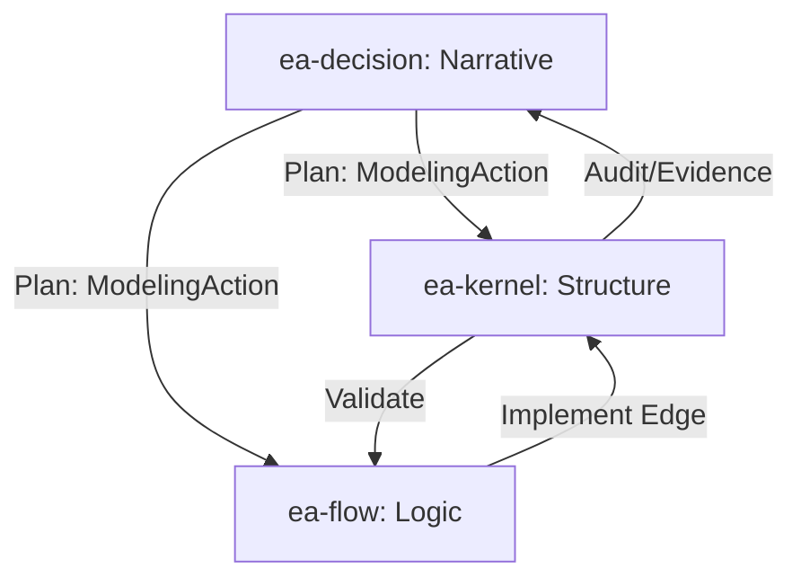

# EA System Spec Layers: Architecture Framework

본 문서는 EA System의 핵심 구성요소인 `ea-kernel`, `ea-flow`, `ea-decision`의 역할 정체성과 상호작용 레이어를 정의한다. 이 시스템은 **V3 Unified Architecture** 원칙에 따라 "Spec as Code" (명세가 곧 코드이자 실행 단위) 철학을 지향한다.

---

## 1. 개요: 세 가지 차원의 명세 (Three Dimensions of Spec)

거버넌스 시스템은 단순히 상태를 기록하는 것을 넘어, "무엇이 존재하는지", "어떻게 움직이는지", "왜 그렇게 결정했는지"를 모두 투명하게 추적할 수 있어야 한다.

| Layer | 역할 | 명세 유형 | 핵심 아티팩트 |
| :--- | :--- | :--- | :--- |
| **ea-kernel** | **구조 (Structure)** | Ontology & Topology Spec | RuleAsset, Relationship, ValidityRule |
| **ea-flow** | **로직 (Logic)** | Behavioral & Data Flow Spec | Workflow, Step, Transformation |
| **ea-decision** | **서사 (Narrative)** | Design thinking & Reasoning Spec | Topic, DesignReport, ModelingAction |

---

## 2. 레이어별 상세 정의

### 2.1 ea-kernel (The Structure Spec)
시스템의 **"정적인 골격"**과 **"거버넌스 준수성"**을 정의한다.
- **Ontology**: 시스템에 존재하는 엔티티(Entity)와 그들 간의 관계(Relation) 유형을 정의한다.
- **Topology**: 실제 인스턴스 간의 연결망을 명세한다.
- **Validity Rules**: "무엇이 옳은 상태인가?"에 대한 제약 조건을 정의한다. (예: "결제 모듈은 외부 네트워크에 직접 연결될 수 없다")

### 2.2 ea-flow (The Logic Spec)
시스템의 **"동적인 흐름"**과 **"절차적 로직"**을 정의한다.
- **Logic behind Edge**: `ea-kernel`이 정의한 연계(Relationship)가 실제로 일어날 때 수행되는 데이터 변환, 분기, 연산 로직을 명세한다.
- **Multi-format Data Modeling**: **JSON Schema 2020-12**, **Database Schema**, **Protobuf** 등 다양한 포맷으로 상세 데이터 구조를 정의하며, 이는 플랫폼 중립적으로 관리된다.
- **Spec as Code**: 정의된 Workflow와 Step은 단순한 문서가 아니며, V3 아키텍처 규칙에 따라 실제 실행 가능한 코드나 바이너리와 Zero-loss 동기화를 유지한다.
- **Abstraction**: 복잡한 실행 절차를 커널에서 분리함으로써, 커널의 복잡성을 낮추고 로직의 재사용성을 높인다.

### 2.3 ea-decision (The Narrative Spec)
시스템의 **"설계 근거"**와 **"의사결정 이력"**을 정의한다.
- **Narrative Logic**: 왜 특정한 구조(Kernel)나 로직(Flow)이 채택되었는지에 대한 비정형/정형 서사를 관리한다.
- **Diverge-Converge**: 자료 조사(Research), 질의응답(Q&A), 옵션 비교(Evaluation) 과정을 거쳐 최종 결론에 도달하는 시간선의 흐름을 기록한다.
- **Modeling Action**: 결론(DesignReport)에 따라 커널이나 플로우를 어떻게 수정해야 하는지에 대한 실행 계획을 도출한다.

---

## 3. 계층 간 연동 모델 (The Interlock)

세 레이어는 다음과 같은 순환 구조를 통해 시스템을 진화시킨다.

1.  **Plan (Decision → Kernel/Flow)**: `ea-decision`에서 결정된 사항은 `ModelingAction`을 통해 `ea-kernel`의 구조적 변경과 `ea-flow`의 로직적 변경을 유도한다.
2.  **Implementation & Refinement (Flow → Kernel)**: `ea-flow`는 `ea-kernel`이 선언한 추상적인 관계(Edge)를 구체적인 절차로 실체화한다. 이때 하나의 관계는 여러 개의 세부 단계로 **분해(Decomposition)**되거나 구체적인 파라미터로 **정교화(Refinement)**될 수 있다.
3.  **Verification (Kernel → Flow)**: `ea-flow`의 모든 로직 정의(`Step`, `Workflow`)는 `ea-kernel`의 엔티티나 관계에 앵커링되어야 하며, `ea-kernel`이 정의한 `Validity Rules`에 부합해야 한다.
4.  **Feedback (Kernel → Decision)**: 커널의 위반 사항이나 상태 변화는 다시 `ea-decision`의 새로운 `Topic`이 되어 "왜 위반이 발생했는가?"에 대한 탐구와 해결로 이어진다.

---

## 4. 아키텍처 원칙: Separation of Concerns

- **표현의 분리**: 커널에 로직을 섞지 않고, 플로우에 거버넌스 규칙을 고정하지 않는다.
- **이력의 보존**: `ea-decision`은 "취소된 결정"이나 "실패한 옵션"까지도 시간선 상에 보존하여 미래의 설계자가 과거의 실수를 반복하지 않게 돕는다.
- **동기화의 보장**: 명세(Spec)가 수정되면 그에 대응하는 코드와 인프라의 상태도 함께 움직여야 한다. (Unified Sync)
